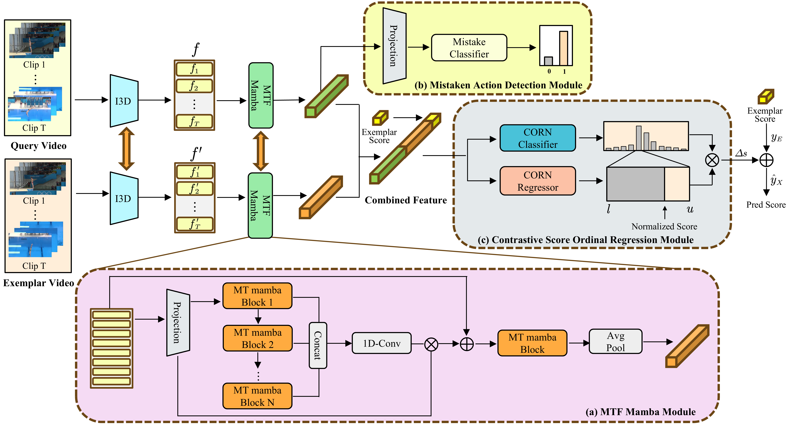

# ORMamba: A Ordinal Regression Framework with Multi-Scale Temporal Fusion Mamba for Action Quality Assessment

This repository contains the PyTorch implementation for ORMamba (**ICME 2026**). 

**Our model checkpoints and preprocessed datasets will be made publicly available upon acceptance of the paper.**

we propose Ordinal Regression Mamba (*__ORMamba__*), an end-to-end AQA framework. ORMamba incorporates a multi-scale temporal fusion Mamba module to capture long-range spatiotemporal dynamics and explicitly models mistaken actions to learn more discriminative representations.Additionally, the framework integrates ordinal regression with contrastive regression for coarse-to-fine precise score estimation, which significantly improves the overall performance.



## Usage

### Requirements

Make sure the following dependencies installed (python):

* pytorch >= 2.4.1
* einops
* timm
* torch_videovision
* CUDA >= 12.4

```
pip install git+https://github.com/hassony2/torch_videovision
```


### Download initial I3D 
We use the Kinetics pretrained I3D model from the reposity [kinetics_i3d_pytorch](https://github.com/hassony2/kinetics_i3d_pytorch/blob/master/model/model_rgb.pth)

### Dataset Preparation

#### FineDiving
- Please download the dataset from the repository [FineDiving](https://github.com/xujinglin/FineDiving).
- The data structure should be:
```
$DATASET_ROOT
├── FineDiving
│   ├── FINADiving_MTL_256s
│   │   ├── FINADivingWorldCup2021_Men3m_final_r1
│   │   │   ├── 0
│   │   │   │   ├── 00489.jpg
│   │   │   │   ...
│   │   │   │   └── 00592.jpg
│   │   │   ...
│   │   │   └── 11
│   │   │       ├── 14425.jpg
│   │   │       ...
│   │   │       └── 14542.jpg
│   │   ├── ...
│   │   └── FullMenSynchronised10mPlatform_Tokyo2020Replays_2
│   │       ├── 0
│   │       ...
│   │       └── 16
│   │
│   └── Annotations
│       ├── FineDiving_coarse_annotation.pkl
│       ├── FineDiving_fine-grained_annotation.pkl
│       ├── fine-grained_annotation_aqa.pkl
│       ├── Sub_action_Types_Table.pkl
│       ├── test_split.pkl
│       └── train_split.pkl

```


#### LOGO
- Please download the dataset from the repository [LOGO](https://github.com/shiyi-zh0408/LOGO).
- After downloading, run the data preparation script to process the dataset:

```bash
python data_prepare_LOGO.py
```
The data structure should be:
```
$DATASET_ROOT
├── LOGO
│   ├── Video_result                     
│   │   ├── WorldChampionship2019_free_final
│   │   │   ├── 0
│   │   │   │   ├── 00000.jpg
│   │   │   │   ...
│   │   │   │   └── 06249.jpg
│   │   │   ├── ...
│   │   │   └── 11
│   │   │       ├── 00000.jpg
│   │   │       ...
│   │   │       └── 06249.jpg
│   │   ├── ...
│   │   └── WorldChampionship2022_free_final
│   │       ├── 0
│   │       ├── ...
│   │       └── 7
│   ├── LOGO_Anno&Split                  
│   │   ├── anno_dict.pkl
│   │   ├── formation_dict.pkl
│   │   ├── test_split3.pkl
│   │   └── train_split3.pkl
│   └── i3d_features_LOGO.pkl            
```

## Train
To train the model, please run:
```bash
python main.py
```

## Test
To test the trained model, please set `test: True` in config and run:
```bash
python main.py
```

